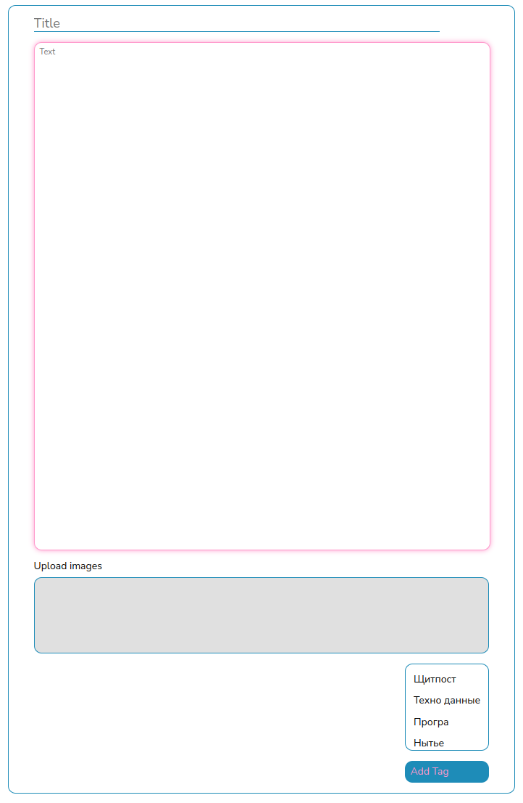
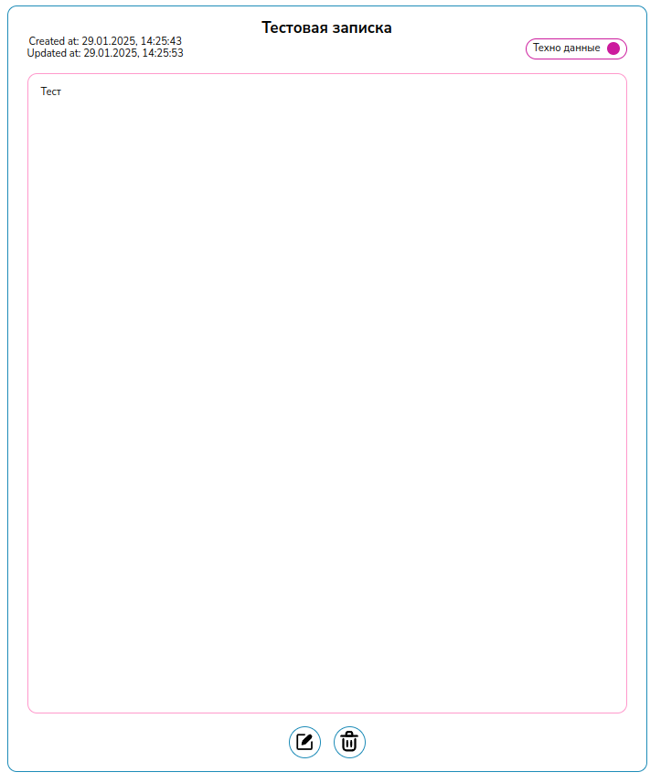
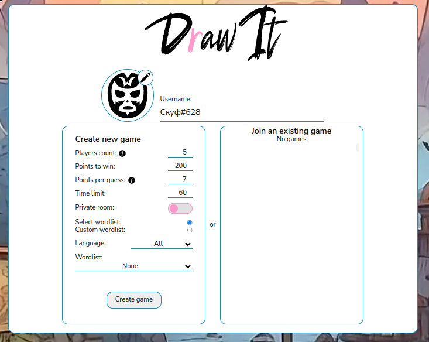

# Ellectronchik Client

## О проекте

**Ellectronchik Client** — это клиентская часть веб-приложения для управления личными данными, включая **дневник** и **менеджер задач**. Проект разработан с использованием **Next.js** и **TypeScript**, а также содержит мини-игру _DrawIt_ на Canvas (находится в стадии разработки).

### Основные возможности:

- **Дневник** — удобный интерфейс для ведения заметок и записей.
- **Менеджер задач** — планирование и управление делами.
- **Мини-игра DrawIt** — в процессе разработки, ожидаются новые функции.

### Интерфейс приложения

| Скриншот                                           | Описание                                 |
| -------------------------------------------------- | ---------------------------------------- |
|     | Окно добавления новой заметки.           |
|   | Готовая заметка в дневнике.              |
|  | Экран игры _DrawIt_ (пока не завершена). |

---

## Построен с использованием

- [Next.js](https://nextjs.org/) — серверный рендеринг и удобный роутинг.
- [TypeScript](https://www.typescriptlang.org/) — строгая типизация.
- [CSS](https://developer.mozilla.org/en-US/docs/Web/CSS) — стилизация интерфейса.

## Начало работы

### Предварительные требования

Перед установкой убедитесь, что у вас установлены:

- [Node.js](https://nodejs.org/)
- [pnpm](https://pnpm.io/)

### Установка и запуск

1. **Клонируйте репозиторий:**
   ```sh
   git clone https://github.com/EllectronChik/ellectronchik_client.git
   ```
2. **Перейдите в директорию проекта:**
   ```sh
   cd ellectronchik_client
   ```
3. **Установите зависимости:**
   ```sh
   pnpm install
   ```
4. **Настройте переменные окружения:**
   Создайте файл `.env.local` и добавьте:
   ```env
   NEXT_PUBLIC_API_URL=<SERVER_URL_ADDRESS>
   NEXT_PUBLIC_GRAPHQL_CONNECTION=$NEXT_PUBLIC_API_URL/graphql
   SECRET=<SECRET_CODE>
   ```
5. **Запустите проект:**
   ```sh
   pnpm run dev
   ```

Приложение будет доступно по адресу **[http://localhost:3000](http://localhost:3000)**.

## Лицензия

Проект распространяется под лицензией **MIT**. Подробности в файле [LICENSE](LICENSE).
